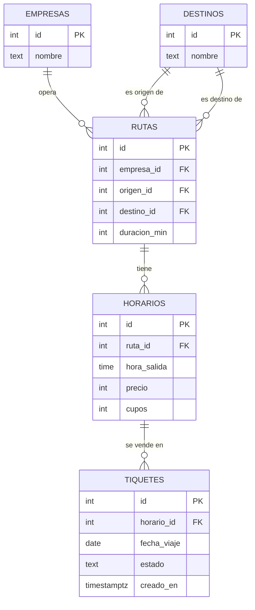

# TerminAPP - Backend

Plataforma para consultar y comprar pasajes de la Terminal de Transportes de Pasto por medio de un chat.
Proyecto final de Estructuras de Datos - Universidad Cooperativa de Colombia, sede Pasto.

## Integrantes
- Juan David Moreno
- Felipe Alejandro Cerón

## URLs
- Backend: https://terminapp-backend.onrender.com
- Frontend: https://terminapp-frontend.vercel.app
- Repositorio frontend: https://github.com/terminapp-pasto/terminapp-frontend

## Tecnologías
Python, FastAPI, PostgreSQL (Neon), Render.

## Base de datos

Diagrama entidad-relación de las 5 tablas en PostgreSQL.

