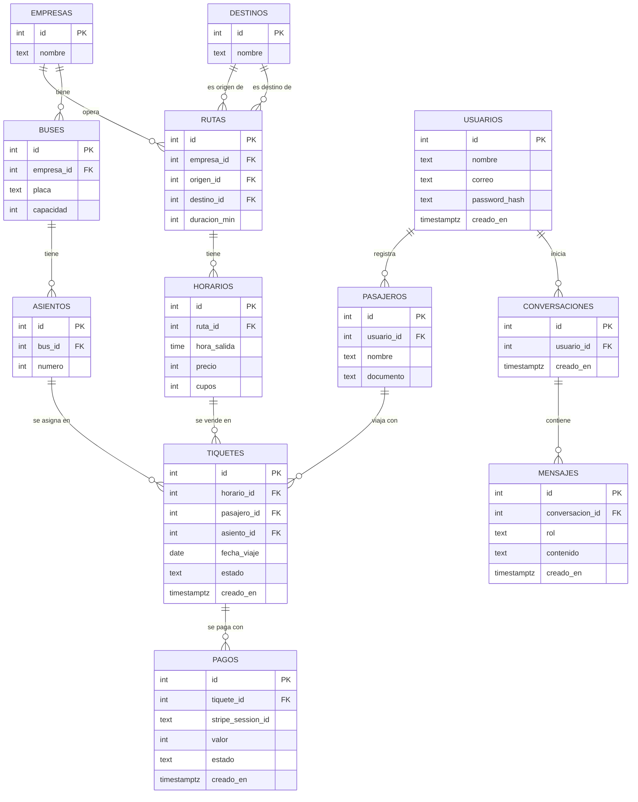
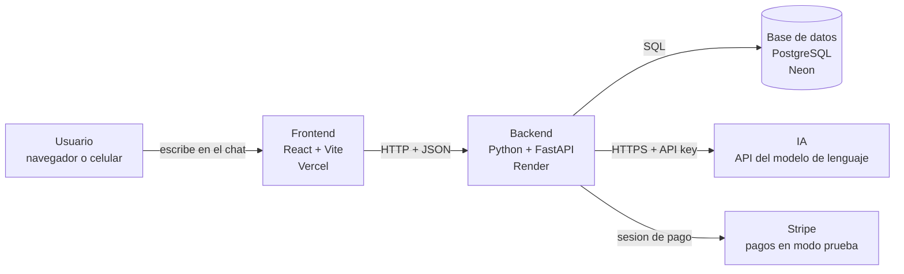
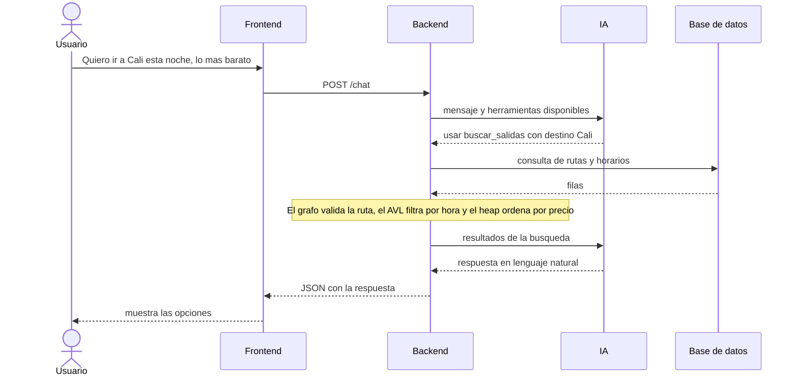

# TerminAPP - Backend

Plataforma para consultar y comprar pasajes de la Terminal de Transportes de Pasto por medio de un chat.
Proyecto final de Estructuras de Datos - Universidad Cooperativa de Colombia, sede Pasto.

## Caso de estudio

**El problema.** Para saber qué buses salen de la Terminal de Transportes de Pasto, a qué hora y cuánto cuestan, hoy una persona tiene que ir hasta la terminal, llamar a cada empresa o revisar varias páginas de venta que no siempre coinciden entre sí. La página oficial de la terminal publica las empresas y los destinos, pero no los horarios ni las tarifas en un solo lugar.

**El usuario.** Personas que viajan desde Pasto hacia municipios de Nariño y hacia ciudades como Cali, Mocoa o Bogotá: estudiantes, trabajadores y familias que necesitan comparar opciones rápido y que no siempre tienen experiencia usando aplicaciones.

**Por qué la IA ayuda.** El usuario escribe como habla, por ejemplo "quiero ir a Cali esta noche, lo más barato", y la IA convierte esa frase en una búsqueda concreta: destino, hora y forma de ordenar. La búsqueda la resuelven las estructuras de datos del backend, y la IA devuelve el resultado en lenguaje natural y guía la compra. Así nadie tiene que aprender a usar filtros ni formularios.

## Integrantes
- Juan David Moreno
- Felipe Alejandro Cerón

## URLs
- Backend: https://terminapp-backend.onrender.com
- Frontend: https://terminapp-frontend.vercel.app
- Repositorio frontend: https://github.com/terminapp-pasto/terminapp-frontend

## Tecnologías
Python, FastAPI, PostgreSQL (Neon), Render.

## Base de datos

Diagrama entidad-relación de las 12 tablas en PostgreSQL. Las 5 primeras sostienen la búsqueda; las demás, la autenticación, la compra, el pago y el chat con la IA.

## Arquitectura

TerminAPP tiene cuatro capas. El frontend solo habla con el backend, y el backend es el único que habla con la base de datos, con la IA y con Stripe. Las claves viven en variables de entorno del backend, nunca en el frontend ni en Git.

### Recorrido de una petición

